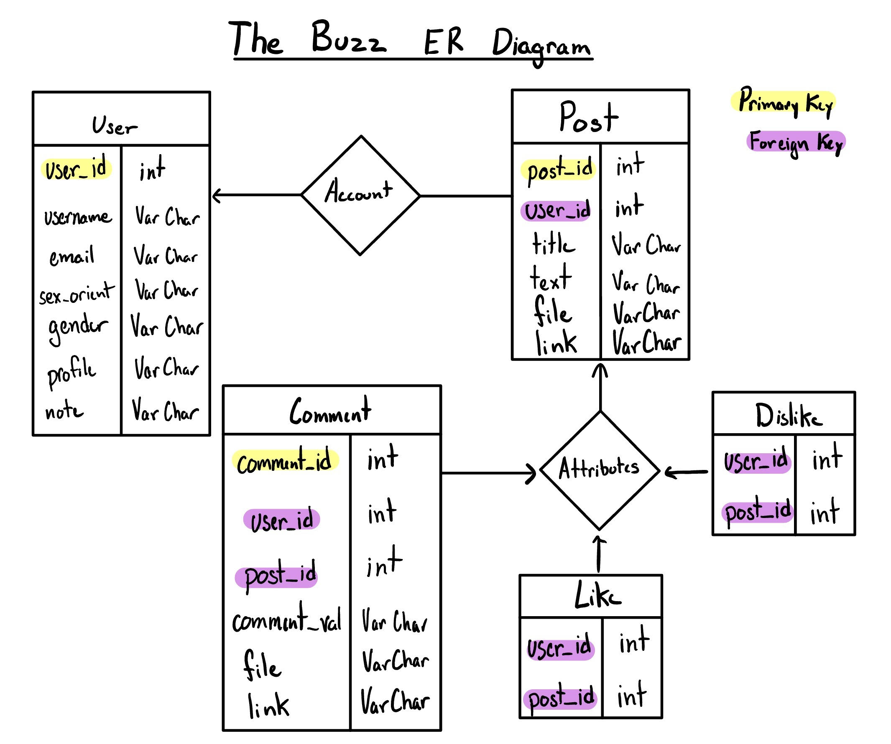
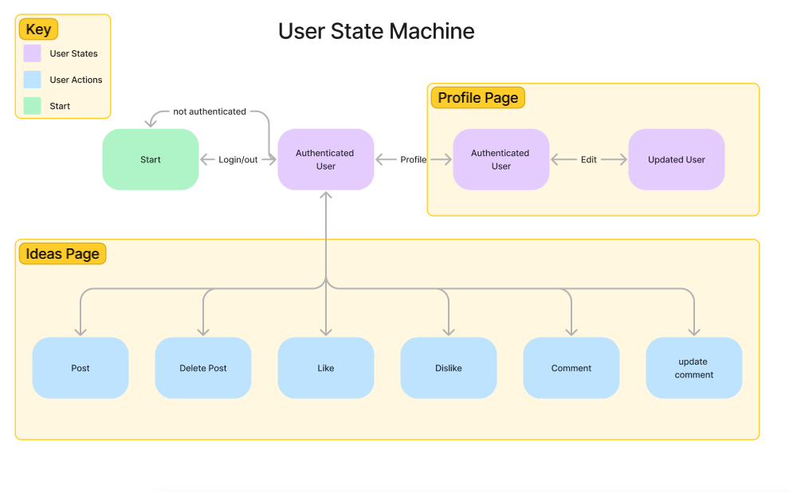
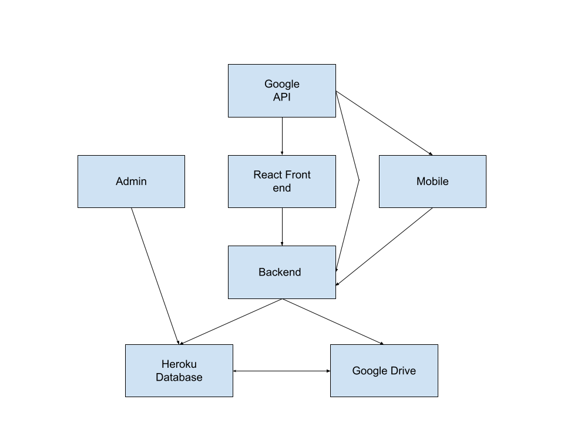

## Project: The Buzz

## Descrition:
- The Buzz is a social media app where users can post, delete, like, and edit messages. 

## Contributors
1. Yash Patel - yap224@lehigh.edu
2. Sean Noto - scn224@lehigh.edu
3. Tiana Aldroubi - tma224@lehigh.edu
4. Aryan Tawde - art223@lrhigh.edu
4. Wilson Zheng - wjz224@lehigh.edu

## Deployment
1. Go into the thebuzz folder and run "sh deploy.sh"
2. Go into backend folder and run "mvn package; mvn heroku:deploy"

## Current Backlog
Web: Don't refresh after every change. Instead update the state

Admin: Make column label print automatic instead of manually typing with the for loop function and make unit tests test all options.

Backend: Fix the unit test bug in the backend where it references the 3rd row in the database

Mobile: automatically update the view after something is liked, Store post data in objects not strings

## Unit Test Descriptions for Phase 2
Web: 
    1.Make sure user can be authenticated
    2.Test that user can make a comment/edit a comment
    3.Make sure like and dislike buttons work

Admin: 
	1. Make sure user can add rows in the post and comment table
	2. Make sure user is able to update tables using the like/dislike buttons
	3. Make sure entries in tables can be changed such as likes
	4. Be able to remove rows from the post table

Backend: 
	1. Get access token from google using google api
	2. Make sure authenticated user information is stored in local hashtable
	3. Make sure new routes for comment table works

Mobile:  
    1. Make sure like and dislike changes the appearance of the buttons
    2. Use MobileTest to see if pages change with the appropriate click
    3. Make sure that the scroll feature for the main page and comment page work
    4. Make sure that buttons are connected to the right routes and the data changes on the  
                webpage

## User Stories

1. U1: As an Admin I want to edit the database directly because I need to update and maintain it. (Manual test)

2. U2: As an Admin I want to add/drop tables for maintenance purposes. (Manual test)

3. U3: As an Admin I want to manage new columns because I want to maintain parts of the database data. (Manual Test)

4. U4: As an Admin  I want to manage new tables because I want to maintain the database as a whole. (Manual Test) 

5. U5: As an Authenticated User I want to like and unlike posts so I can show support for the posts I like. (Automatic test)

6. U6: As an Authenticated User I want to post text so I can share my ideas to others. (Automatic test)

7. U7: As an Authenticated user  I want to like posts because I want to interact with other idea creators. (Automatic test)

8. U8: As an Authenticated user  I want to edit my own comments because I may have typos on my comments. (Automatic test)

9. U9: As an Authenticated user  I want to create a user profile with personal information because I want people to know who is posting the text. (Automatic test)

## Routes
- __Get__: returns one entity from the table post
   - \GET /messages 
   - JSON Route: 
         - "mId" = int
         - "mTitle" = String
         - "mContent" = String
         - "mLikes" = int
         - "mCreated" = timecreated
  
- __Get__: returns one entity from the table comment
    - \GET /comments
    - JSON Route:
        - "mId" = int
        - "mCommentId" = int
        - "mCommentLikes" = int
        - "mCommentDislikes" = int
        - "mComment" = String
    

- __Post__: adds a new message, title, messageId, and like counter to the current database table
    - \POST /messages
    - JSON Route: 
         - "mTitle" = String
         - "mContent" = String
  
- __Post__ : adds a new comment to the associated messageId
    - \POST /comments
    - JSON Route: 
        - "mId" = int
        - "mComment" = String
  
- __Delete__: removes an entity specified by an ID number from the table
    - \DELETE /messages/#
    - JSON Route: 
        - "mId" = int
  
- __Delete__: Removes a comment specified by the commentId
    - \DELETE /comments/#
    - JSON Route: 
         - "mCommentId" =  int
   
- __Put__: changes an existing entity in the table by specifying an ID number
    - \PUT /messages/#
    - JSON Route:
        - "mId" = int
        - "mContent" = String

- __Put__: Adds likes for message
    - \PUT /messages/#/likes
    - JSON Route:
        - "mId" = int
        -  "mLikes" = int
      
- __Put__: Adds dislikes for message
    - \PUT /messages/#/dislikes
    -  JSON Route:
        - "mId" = int
        - "mDislikes" = int
      
- __Put__: Update Comment
    - \PUT /comments/#
    - JSON Route: 
         - "mId" = int
         - "mComment" = String
      
- __Put__: Adds likes for comment
    - \PUT /comments/#/likes
    - JSON Route:
        - "mCommentId" = int
        - "mCommentLikes" = int
  
- __Put__: Adds dislikes for comment
    - \PUT /comments/#/dislikes
    - JSON Route:
         - "mCommentId" = int
         - "mCommentDislikes" = int
  
## Javadoc documentation
Read HTML file for App.java and Database.java [here](./backend\src\main\java\edu\lehigh\cse216\yap224\backend\JavadocHTMLFiles\index-all.html) 

  
## Test Description
- __Backend__: Use the AppTest.java file to create script that automatically runs the routes for get, post, put, and delete then makes sures then Make sure that posts added through the front end/mobile actually appear in database

Use Database.java to test the different methods in the Database.java class

- __Admin__: Check that tables can be edited and created/deleted

- __Web front-end__: Make sure buttons correctly display respective behavior, make sure user is able to add text to necessary fields, make sure messages are displayed correctly

- __Mobile__: 

1. Make sure like and dislike changes the appearance of the buttons 
2. Use MobileTest to see if pages change with the appropriate click
3. Make sure that the scroll feature for the main page and comment page work
4. Make sure that buttons are connected to the right routes and the data changes on the webpage

## ERD

## State Machines (idea, user)

## System Diagram

## Desktop and Mobile Renders

## Mobile Page

## Invite Trello Link 
 https://trello.com/invite/b/ktZREaYO/6223f419fbe085536c4393c2cb3ff528/tutorial-board-1
 
## Link for folder with project resources
https://drive.google.com/drive/folders/1bG9Afm0etEM5-NCcldsnn2dRRtsRPe1x?usp=sharing

## Documentation for React branch:
[React Documentation](thebuzz/docs/index.html)
