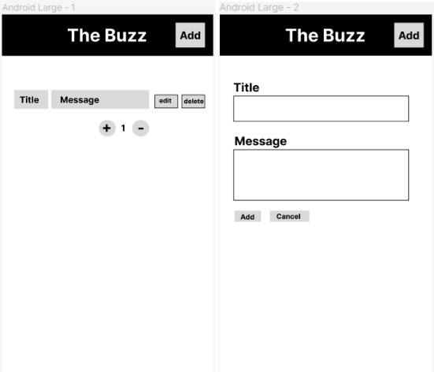

## Project: The Buzz

## Descrition:
- The Buzz is a social media app where users can post, delete, like, and edit messages. 

## Contributors
1. Yash Patel - yap224@lehigh.edu
2. Sean Noto - scn224@lehigh.edu
3. Tiana Aldroubi - tma224@lehigh.edu
4. Aryan Tawde - art223@lrhigh.edu
4. Wilson Zheng - wjz224@lehigh.edu

## User Stories

U1: As an Admin I want to edit the database directly because I need to update and maintain it. (Manual test)

U2: As an Admin I want to add/drop tables for maintenance purposes

U3: As a User I want to like and unlike posts so I can show support for the posts I like. (Automatic test)

U4: As a User I want to post text so I can share my ideas to others. (Automatic test)

## Routes
- __Get__: returns one entity from the table
  \GET /messages 
  JSON Route: {
    "mId" = int
    "mTitle" = String
    "mContent" = String
    "mLikes" = int
    "mCreated" = timecreated
  }

- __Post__: adds a new message, title, and like counter to the current database table
  \POST /messages
  JSON Route: {
    "mTitle" = String
    "mContent" = String
  }

- __Delete__: removes an entity specified by an ID number from the table
  \DELETE /messages/#
  JSON Route: {
    "mId" = int
  }

- __Put__: changes an existing entity in the table by specifying an ID number
  \PUT /messages/#
JSON Route:{
  "mId" = int
  "mContent" = String
}

- __Put__: Adds like or dislikes if already liked
  \PUT /messages/#/3
JSON Route:{
  "mID" = int
}

## Javadoc documentation
Read HTML file for App.java and Database.java [here](./backend\src\main\java\edu\lehigh\cse216\yap224\backend\JavadocHTMLFiles\index-all.html) 

  
## Test Description
- __Backend__: Use the AppTest.java file to create script that automatically runs the routes for get, post, put, and delete then makes sures then Make sure that posts added through the front end/mobile actually appear in database

Use Database.java to test the different methods in the Database.java class

- __Admin__: Check that tables can be edited and created/deleted

- __Web front-end__: Make sure buttons correctly display respective behavior, make sure user is able to add text to necessary fields, make sure messages are displayed correctly

- __Mobile__: Make sure buttons correctly display respective behavior, make sure user is able to add text to necessary fields, make sure messages are displayed correctly

## ERD

## State Machine

## System Diagram

## Desktop and Mobile Renders

## Invite Trello Link 
 https://trello.com/invite/b/ktZREaYO/6223f419fbe085536c4393c2cb3ff528/tutorial-board-1
 
## Link for folder with project resources
https://drive.google.com/drive/folders/1bG9Afm0etEM5-NCcldsnn2dRRtsRPe1x?usp=sharing

## Documentation for React branch:

